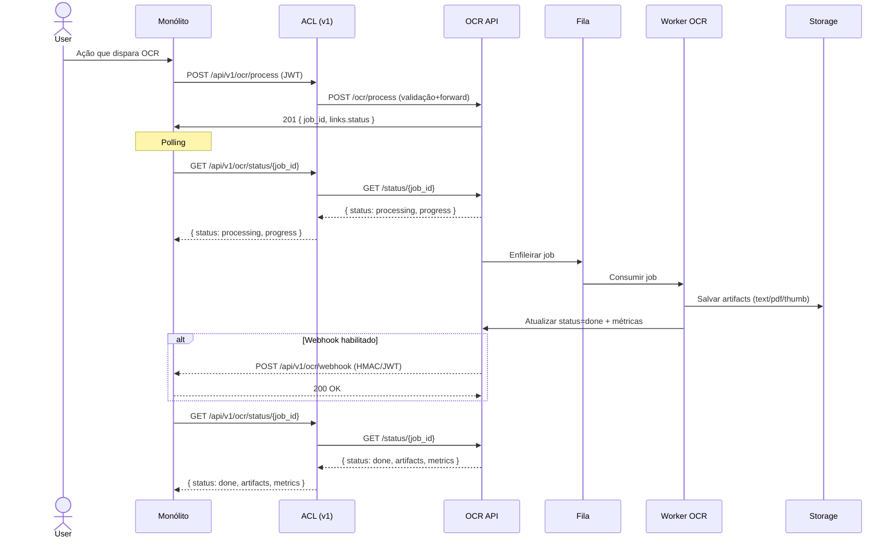
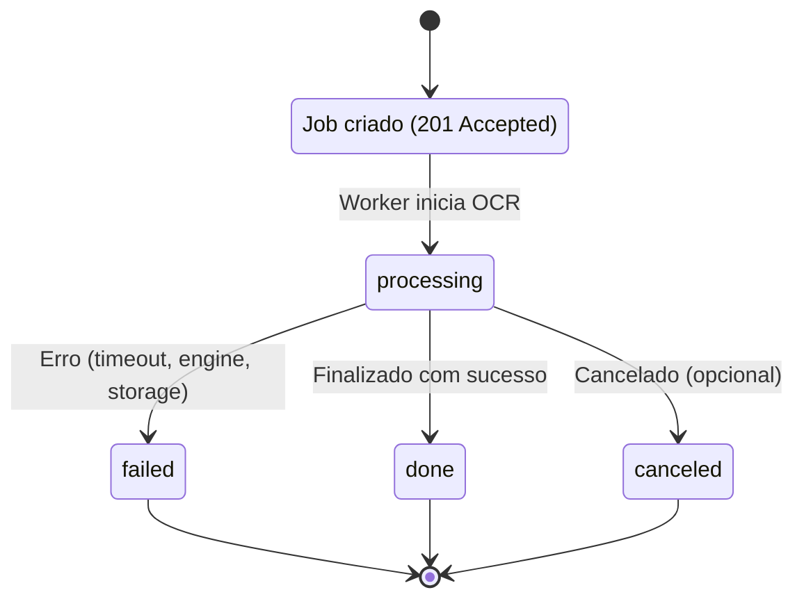

# OCR_API_CONTRACT.md — Contrato de API
 
## Visão rápida
 
Contrato mínimo para integrar o microserviço OCR ao monólito via ACL. Objetivo: ser pequeno, versionável e permitir compatibilidade regressiva. Use `v1` no path/headers até estabilizar.
 
----------
 
## Diagramas
 
### Arquitetura
 
```mermaid
flowchart LR
    subgraph Client["Monólito (Cliente da ACL)"]
        UI["UI / Ações do usuário"]
        MONO["Monólito"]
    end
 
    subgraph ACL["ACL / API Gateway (v1)"]
        ROUTER["Roteamento + Auth/JWT + Rate limiting"]
        SCHEMAS["Validação (OpenAPI/JSON Schema)"]
    end
 
    subgraph OCR["Serviço OCR"]
        API["OCR API (process/status/webhook)"]
        QUEUE["Fila de Jobs"]
        WORKER["Workers OCR (Tesseract)"]
        METRICS["Métricas/Prometheus"]
    end
 
    subgraph STORAGE["Storage de Artefatos"]
        TEXT["text.txt"]
        PDF["searchable.pdf"]
        THUMB["thumb.png"]
    end
 
    IDP["Identity Provider (JWT)"]
    OBS["Observabilidade (Logs/Tracing/Métricas)"]
 
    UI --> MONO
    MONO -->|Bearer JWT| ROUTER
    ROUTER --> SCHEMAS
    SCHEMAS --> API
    API --> QUEUE
    QUEUE --> WORKER
    WORKER --> STORAGE
    API --> METRICS
    MONO <-->|Webhook (HMAC/JWT)| API
 
    MONO -->|Polling status| API
    IDP --> MONO
    IDP --> ROUTER
 
    ACL --- OBS
    OCR --- OBS
```
 
### Sequência de Processamento
 

 
### Estados do Job
 

 
 
## Endpoints principais

### POST /api/v1/ocr/process

-   **Descrição:** Submete um arquivo (ou referência) para processamento OCR.
    
-   **Autenticação:** `Authorization: Bearer <JWT>` (veja regras abaixo).
    
-   **Content-Type:** `multipart/form-data` ou `application/json` (quando usar `file_ref`).
    
-   **Request (multipart — preferível para evitar inconsistências de storage):**
    
    -   `file` — arquivo binário (opcional se usar `file_ref`)
        
    -   `file_ref` — URI de armazenamento já disponível (ex.: `s3://bucket/path/...`) — opcional
        
    -   `document_id` — id interno do `Document` no monólito (opcional, mas recomendado)
        
    -   `lang` — `pt`, `en`, `auto` (opcional)
        
    -   `config` — JSON string com flags (ex.: `{"force_ocr": true, "create_searchable_pdf": true}`)
        
-   **Resposta (201 Accepted) — body:**
    

```json
{
  "job_id": "uuid-v4",
  "status": "accepted",
  "submitted_at": "2025-10-19T08:00:00Z",
  "links": {
    "status": "/api/v1/ocr/status/{job_id}"
  }
}

```

-   **Códigos de status importantes:**
    
    -   `201` — aceito (job criado)
        
    -   `400` — payload inválido
        
    -   `401/403` — auth/permission
        
    -   `422` — arquivo inválido / tipo não suportado
        
    -   `500` — erro interno
        

----------

### GET /api/v1/ocr/status/{job_id}

-   **Descrição:** Consulta status do job.
    
-   **Resposta (200):**
    

```json
{
  "job_id": "uuid-v4",
  "status": "processing", // processing | done | failed | canceled
  "progress": 45,        // percentual (0-100) opcional
  "started_at": "2025-10-19T08:01:00Z",
  "updated_at": "2025-10-19T08:03:00Z",
  "result": null
}

```

-   **Resposta (200) quando pronto:**
    

```json
{
  "job_id": "uuid-v4",
  "status": "done",
  "progress": 100,
  "artifacts": {
    "text_uri": "https://storage/.../123/text.txt",
    "searchable_pdf_uri": "https://storage/.../123/searchable.pdf",
    "thumbnail_uri": "https://storage/.../123/thumb.png"
  },
  "metrics": {
    "ocr_engine": "tesseract-5.0",
    "pages_processed": 3,
    "time_ms": 1234
  }
}

```

-   **Resposta (200) quando falha:**
    

```json
{
  "job_id": "uuid-v4",
  "status": "failed",
  "error": {
    "code": "OCR_TIMEOUT",
    "message": "Tesseract timed out",
    "details": "worker-3"
  }
}

```

----------

### POST /api/v1/ocr/webhook

-   **Descrição:** (Opcional) OCR/ACL notifica o monólito diretamente quando o job terminar.
    
-   **Segurança:** HMAC-SHA256 no header `X-Webhook-Signature` ou JWT assinado com secret compartilhado.
    
-   **Payload exemplo:**
    

```json
{
  "job_id": "uuid-v4",
  "document_id": 123,
  "status": "done",
  "artifacts": { ... }
}

```

-   **Retorno:** `200 OK` para aceitar; `401/403` para rejeitar assinatura.
    

----------

### Health & Admin

-   `GET /api/v1/health` — retorna `{"status":"ok","dependencies":{"tesseract":true,"tika":true,"storage":true}}`
    
-   `GET /api/v1/metrics` — Prometheus-format (ou endpoint exportável)
    

----------

## Regras de autenticação e autorização

1.  **Autenticação:** JWT com claim `sub` (user id) e `iss` (issuer). Tokens emitidos pelo monólito ou por um Identity Provider confiável.
    
2.  **Escopos/Claims mínimos exigidos:**
    
    -   `scope` deve conter `documents:write` para criar jobs
        
    -   `scope` com `documents:read` para consultar status/artefatos
        
    -   claim `tenant_id` quando multi-tenant
        
3.  **ACL:** valida o token recebido; opcionalmente troca por token interno entre ACL ↔ OCR (mecanismo de token exchange).
    
4.  **Assinatura de webhook:** HMAC usando secret armazenado no monólito; validar antes de aceitar atualização de status.
    
5.  **Rate limiting:** per-user e per-tenant (ex.: 10 req/min) — devolver `429` quando exceder.
    

----------

## Versionamento

-   Versão no path: `/api/v1/...`.
    
-   Para mudanças incompatíveis, criar `/api/v2/...`.
    
-   O ACL atua como camada de compatibilidade (fazer tradução entre versões).
    